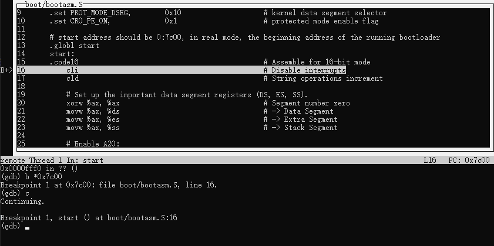

# 实验一：系统软件启动过程

17343025 冯浚轩 软件工程

## 实验目的

操作系统是一个软件，也需要通过某种机制加载并运行它。通过bootloader软件完成计算机启动后切换CPU到保护模式的操作，准备启动操作系统

## 实验要求

完成bootloader的编写

## 实验方案

配置环境，根据实验内容要求做

在Makefile中有`qemu`和`debug`目标便于启动qemu和调试，现根据我的当前环境添加`my-qemu`和`my-debug`目标，如下

```makefile
my-qemu: $(UCOREIMG)
	$(V)$(QEMU) -S -s -nographic -no-reboot -hda $<

my-debug: $(UCOREIMG)
	$(V)gdb -q -tui -x tools/gdbinit
```

根据调试的需要修改gdbinit文件进行调试初始化

## 实验过程

### 练习 1：理解通过make生成执行文件的过程

#### 操作系统镜像文件 ucore.img 是如何一步一步生成的

在终端中输入`make -n`输出构建过程执行的命令

```bash
echo + cc kern/init/init.c
gcc -Ikern/init/ -fno-builtin -fno-PIC -Wall -ggdb -m32 -gstabs -nostdinc  -fno-stack-protector -Ilibs/ -Ikern/debug/ -Ikern/driver/ -Ikern/trap/ -Ikern/mm/ -c kern/init/init.c -o obj/kern/init/init.o
echo + cc kern/libs/stdio.c
gcc -Ikern/libs/ -fno-builtin -fno-PIC -Wall -ggdb -m32 -gstabs -nostdinc  -fno-stack-protector -Ilibs/ -Ikern/debug/ -Ikern/driver/ -Ikern/trap/ -Ikern/mm/ -c kern/libs/stdio.c -o obj/kern/libs/stdio.o
# 省略中间的.o文件生成
mkdir -p bin/
echo + ld bin/kernel
ld -m    elf_i386 -nostdlib -T tools/kernel.ld -o bin/kernel  obj/kern/init/init.o obj/kern/libs/stdio.o obj/kern/libs/readline.o obj/kern/debug/panic.o obj/kern/debug/kdebug.o obj/kern/debug/kmonitor.o obj/kern/driver/clock.o obj/kern/driver/console.o obj/kern/driver/picirq.o obj/kern/driver/intr.o obj/kern/trap/trap.o obj/kern/trap/vectors.o obj/kern/trap/trapentry.o obj/kern/mm/pmm.o  obj/libs/string.o obj/libs/printfmt.o
objdump -S bin/kernel > obj/kernel.asm
objdump -t bin/kernel | sed '1,/SYMBOL TABLE/d; s/ .* / /; /^$/d' > obj/kernel.sym
echo + cc boot/bootasm.S
gcc -Iboot/ -fno-builtin -fno-PIC -Wall -ggdb -m32 -gstabs -nostdinc  -fno-stack-protector -Ilibs/ -Os -nostdinc -c boot/bootasm.S -o obj/boot/bootasm.o
echo + cc boot/bootmain.c
gcc -Iboot/ -fno-builtin -fno-PIC -Wall -ggdb -m32 -gstabs -nostdinc  -fno-stack-protector -Ilibs/ -Os -nostdinc -c boot/bootmain.c -o obj/boot/bootmain.o
echo + cc tools/sign.c
gcc -Itools/ -g -Wall -O2 -c tools/sign.c -o obj/sign/tools/sign.o
gcc -g -Wall -O2 obj/sign/tools/sign.o -o bin/sign
echo + ld bin/bootblock
ld -m    elf_i386 -nostdlib -N -e start -Ttext 0x7C00 obj/boot/bootasm.o obj/boot/bootmain.o -o obj/bootblock.o
objdump -S obj/bootblock.o > obj/bootblock.asm
objcopy -S -O binary obj/bootblock.o obj/bootblock.out
bin/sign obj/bootblock.out bin/bootblock
dd if=/dev/zero of=bin/ucore.img count=10000
dd if=bin/bootblock of=bin/ucore.img conv=notrunc
dd if=bin/kernel of=bin/ucore.img seek=1 conv=notrunc
```

开始要编译生成必要的.o文件，以开头的命令为例

```bash
gcc -Ikern/init/ -fno-builtin -fno-PIC -Wall -ggdb -m32 -gstabs -nostdinc  -fno-stack-protector -Ilibs/ -Ikern/debug/ -Ikern/driver/ -Ikern/trap/ -Ikern/mm/ -c kern/init/init.c -o obj/kern/init/init.o
```

对gcc的参数进行一些说明

- `-I` 指定头文件的目录
- `-fno-builtin` 禁用隐含的内置函数
- `-fno-PIC` 不编译成位置无关代码
- `-Wall` 开启所有警告
- `-ggdb` 生成GDB的调试信息
- `-gstabs` 生成stabs格式的调试信息
- `-m32` 生成i386系统的代码
- `-nostdinc` 不使用标准C库的头文件
- `-fno-stack-protector` 不进行栈保护
- `-c` 编译但不链接

先编译跟kernel相关的文件，完成后链接生成kernel，以下是链接过程

```bash
mkdir -p bin/
echo + ld bin/kernel
ld -m    elf_i386 -nostdlib -T tools/kernel.ld -o bin/kernel  obj/kern/init/init.o obj/kern/libs/stdio.o obj/kern/libs/readline.o obj/kern/debug/panic.o obj/kern/debug/kdebug.o obj/kern/debug/kmonitor.o obj/kern/driver/clock.o obj/kern/driver/console.o obj/kern/driver/picirq.o obj/kern/driver/intr.o obj/kern/trap/trap.o obj/kern/trap/vectors.o obj/kern/trap/trapentry.o obj/kern/mm/pmm.o  obj/libs/string.o obj/libs/printfmt.o
objdump -S bin/kernel > obj/kernel.asm
objdump -t bin/kernel | sed '1,/SYMBOL TABLE/d; s/ .* / /; /^$/d' > obj/kernel.sym
```

首先建立bin/目录，然后调用链接器以先前编译的.o文件为源链接为kernel文件输出到bin/目录中，以下是对链接器参数的一些说明

- `-m` 设置生成的文件格式，此处是elf_i386
- `-nostdlib` 不使用标准库，只使用指定的库链接
- `-T` 读取链接器脚本

最后再调用objdump工具对生成的kernel文件进行一些操作，以下是参数说明

- `-S` 进行反汇编并与源代码混合
- `-t` 显示符号表

反汇编输出重定向到kernel.asm文件，而符号表通过管道输入sed工具处理后重定向到kernel.sym文件

接着是生成bootclock的过程

```bash
echo + cc boot/bootasm.S
gcc -Iboot/ -fno-builtin -fno-PIC -Wall -ggdb -m32 -gstabs -nostdinc  -fno-stack-protector -Ilibs/ -Os -nostdinc -c boot/bootasm.S -o obj/boot/bootasm.o
echo + cc boot/bootmain.c
gcc -Iboot/ -fno-builtin -fno-PIC -Wall -ggdb -m32 -gstabs -nostdinc  -fno-stack-protector -Ilibs/ -Os -nostdinc -c boot/bootmain.c -o obj/boot/bootmain.o
echo + cc tools/sign.c
gcc -Itools/ -g -Wall -O2 -c tools/sign.c -o obj/sign/tools/sign.o
gcc -g -Wall -O2 obj/sign/tools/sign.o -o bin/sign
echo + ld bin/bootblock
ld -m    elf_i386 -nostdlib -N -e start -Ttext 0x7C00 obj/boot/bootasm.o obj/boot/bootmain.o -o obj/bootblock.o
objdump -S obj/bootblock.o > obj/bootblock.asm
objcopy -S -O binary obj/bootblock.o obj/bootblock.out
bin/sign obj/bootblock.out bin/bootblock
```

首先编译bootasm.S和bootmain.c，然后链接，对新增参数解释

- `-N` 不进行页对齐，让代码段可写
- `-e` 设置入口地址
- `-Ttext` 设置代码段地址

然后对生成的bootblock.o文件反汇编，再使用objcopy工具加上`-S`参数移除所有符号和重定位信息复制为bootblock.out，再使用上面编译的sign程序对其处理生成bootblock文件

之后再使用dd工具创建img镜像

```bash
dd if=/dev/zero of=bin/ucore.img count=10000
dd if=bin/bootblock of=bin/ucore.img conv=notrunc
dd if=bin/kernel of=bin/ucore.img seek=1 conv=notrunc
```

首先对10000个块写入空字符，然后写入bootblock，使用`conv=notrunc`参数防止被裁切，然后跳过输出镜像的起始1个块写入kernel

#### 一个被系统认为是符合规范的硬盘主引导扇区的特征是什么？

可认定bootblock即为主引导扇区，查看sign.c文件有如下语句

```c
    buf[510] = 0x55;
    buf[511] = 0xAA;
    // ...
    printf("build 512 bytes boot sector: '%s' success!\n", argv[2]);
```

可知主引导扇区的特征为

- 大小为512字节
- 最后两字节内容为0x55AA

### 练习2：使用 qemu 执行并调试 lab1 中的软件

在shell中输入`make my-qemu`启动qemu，相关命令为

```makefile
my-qemu: $(UCOREIMG)
	$(V)$(QEMU) -S -s -nographic -no-reboot -hda $<
```

关于使用的参数的解释

- `-S` 启动时挂起，以便使用gdb调试
- `-s` 使用gdb调试
- `-nographic` 不使用图形输出，直接在终端上输出
- `-no-reboot` 不自动重启
- `-hda` 使用文件作为IDE磁盘镜像

再在一个新的shell中输入`make my-debug`开始调试，相关命令为

```makefile
my-debug: $(UCOREIMG)
	$(V)gdb -q -tui -x tools/gdbinit
```

修改gdbinit文件如下

```text
file obj/bootblock.o
target remote :1234
```

首先读取bootblock.o文件以便获取调试时的源代码，连接qemu启动调试，成功连接后显示如下信息

```bash
remote Thread 1 In:                                  L??   PC: 0xfff0
0x0000fff0 in ?? ()
(gdb)
```

此处gdb的地址高位显示有问题，但从低位地址`0xfff0`可见此时CPU将要执行启动后的第一条指令启动BIOS

接下来设置断点到bootloader入口处

```bash
(gdb) b *0x7c00
```

成功后有如下信息

```bash
Breakpoint 1 at 0x7c00: file boot/bootasm.S, line 16.
```

打开bootasm.S文件可验证在第16行是入口地址，接着输入`c`运行程序到断点处，有如下结果



说明程序正确停在了bootloader的入口处

接下来在qemu的启动命令中加入`-d in_asm -D q.log`参数记录执行的汇编指令，在生成的q.log文件中查找`0x7c00`有如下信息

```x86asm
IN:
0x00007c00:  cli
0x00007c01:  cld
0x00007c02:  xor    %ax,%ax
0x00007c04:  mov    %ax,%ds
0x00007c06:  mov    %ax,%es
0x00007c08:  mov    %ax,%ss
```

可以看到与bootasm.S文件中的指令一致，证明能正确加载bootloader程序

### 练习 3：分析 bootloader 进入保护模式的过程

首先关中断，设置字符串指令方向为前向

```x86asm
cli           # Disable interrupts
cld           # String operations increment
```

然后清空段寄存器

```x86asm
# Set up the important data segment registers (DS, ES, SS).
xorw %ax, %ax            # Segment number zero
movw %ax, %ds            # -> Data Segment
movw %ax, %es            # -> Extra Segment
movw %ax, %ss            # -> Stack Segment
```

接着打开A20 GATE

1. 首先等待8042空闲，然后向`0x64`地址发送`0xd1`指令

    ```x86asm
    seta20.1:
        inb $0x64, %al      # Wait for not busy(8042 input buffer empty).
        testb $0x2, %al
        jnz seta20.1

        movb $0xd1, %al     # 0xd1 -> port 0x64
        outb %al, $0x64     # 0xd1 means: write data to 8042's P2 port
    ```

2. 然后再次等待8042空闲，接着向`0x60`地址发送`0xdf`指令

    ```x86asm
        seta20.2:
        inb $0x64, %al      # Wait for not busy(8042 input buffer empty).
        testb $0x2, %al
        jnz seta20.2

        movb $0xdf, %al     # 0xdf -> port 0x60
        outb %al, $0x60     # 0xdf = 11011111, means set P2's A20 bit(the 1 bit) to 1
    ```

然后设置GDTR和GDT

1. 定义GDT

    ```x86asm
    # Bootstrap GDT
    .p2align 2                                          # force 4 byte alignment
    gdt:
        SEG_NULLASM                           # null seg
        SEG_ASM(STA_X|STA_R, 0x0, 0xffffffff) # code seg for bootloader and kernel
        SEG_ASM(STA_W, 0x0, 0xffffffff)       # data seg for bootloader and kernel

    gdtdesc:
        .word 0x17                            # sizeof(gdt) - 1
        .long gdt                             # address gdt
    ```

2. 将GDT的地址载入GDTR

    ```x86asm
    lgdt gdtdesc
    ```

设置CR0寄存器的PE位为1，开启32位保护模式

```x86asm
movl %cr0, %eax
orl $CR0_PE_ON, %eax
movl %eax, %cr0
```

跳转到32位代码段继续执行

```x86asm
ljmp $PROT_MODE_CSEG, $protcseg
```

其中代码段选择子在文件开头定义，索引为1，TI为0，特权级为0

```x86asm
.set PROT_MODE_CSEG,        0x8
```

设置其它的段

```x86asm
.code32                              # Assemble for 32-bit mode
protcseg:
        # Set up the protected-mode data segment registers
        movw $PROT_MODE_DSEG, %ax    # Our data segment selector
        movw %ax, %ds                # -> DS: Data Segment
        movw %ax, %es                # -> ES: Extra Segment
        movw %ax, %fs                # -> FS
        movw %ax, %gs                # -> GS
        movw %ax, %ss                # -> SS: Stack Segment
```

其中数据段选择子定义为索引为2，TI为0，特权级为0

```x86asm
.set PROT_MODE_DSEG,        0x10    # kernel data segment selector
```

建立栈，跳转到bootloader的C代码处继续执行

```x86asm
movl $0x0, %ebp
movl $start, %esp
call bootmain
```

至此bootloader完成进入保护模式的过程

### 练习 4：分析 bootloader 加载 ELF格式的 OS的过程

#### bootloader 如何读取硬盘扇区的？

bootmain.c文件中的`readsect`函数进行读取硬盘扇区的操作

```c
/* readsect - read a single sector at @secno into @dst */
static void
readsect(void *dst, uint32_t secno) {
    // wait for disk to be ready
    waitdisk();

    outb(0x1F2, 1);           // count = 1
    outb(0x1F3, secno & 0xFF);
    outb(0x1F4, (secno >> 8) & 0xFF);
    outb(0x1F5, (secno >> 16) & 0xFF);
    outb(0x1F6, ((secno >> 24) & 0xF) | 0xE0);
    outb(0x1F7, 0x20);       // cmd 0x20 - read sectors

    // wait for disk to be ready
    waitdisk();

    // read a sector
    insl(0x1F0, dst, SECTSIZE / 4);
}
```

首先调用`waitdisk`函数等待硬盘空闲，查看其定义有

```c
/* waitdisk - wait for disk ready */
static void
waitdisk(void) {
    while ((inb(0x1F7) & 0xC0) != 0x40)
        /* do nothing */;
}
```

查找资料得知`0x1F7`的第7为为0时表示硬盘读写完成，在该函数中不断循环读取该值，直到其为0时退出，再把读取扇区数目和起始扇区编号输出到相应端口，最后向`0x1F7`输出0x20启动读取，再等待硬盘读取结束，再调用`insl`函数将读取的数据转移到内存中

#### bootloader 是如何加载 ELF 格式的 OS？

`bootmain`函数执行加载ELF格式的OS的过程，首先把ELF文件读入内存

```c
static void
readseg(uintptr_t va, uint32_t count, uint32_t offset) {
    uintptr_t end_va = va + count;

    // round down to sector boundary
    va -= offset % SECTSIZE;

    // translate from bytes to sectors; kernel starts at sector 1
    uint32_t secno = (offset / SECTSIZE) + 1;

    // If this is too slow, we could read lots of sectors at a time.
    // We'd write more to memory than asked, but it doesn't matter --
    // we load in increasing order.
    for (; va < end_va; va += SECTSIZE, secno ++) {
        readsect((void *)va, secno);
    }
}

// in bootmain
// read the 1st page off disk
readseg((uintptr_t)ELFHDR, SECTSIZE * 8, 0);
```

`readseq`函数在`readsect`函数上加了一层，实现读取多个扇区以及带偏移量的功能，而在`bootmain`函数中调用该函数读入从kernel开始的一整页

接下来判断是否是合法的ELF文件，若不是则中止跳出

```c
// is this a valid ELF?
if (ELFHDR->e_magic != ELF_MAGIC) {
    goto bad;
}
```

接下来读取program header表，依次从硬盘中将目标文件段读入内存

```c
struct proghdr *ph, *eph;

// load each program segment (ignores ph flags)
ph = (struct proghdr *)((uintptr_t)ELFHDR + ELFHDR->e_phoff);
eph = ph + ELFHDR->e_phnum;
for (; ph < eph; ph ++) {
    readseg(ph->p_va & 0xFFFFFF, ph->p_memsz, ph->p_offset);
}
```

最后程序跳转到ELF中程序入口地址处，启动OS

```c
// call the entry point from the ELF header
// note: does not return
((void (*)(void))(ELFHDR->e_entry & 0xFFFFFF))();
```

### 练习 5：实现函数调用堆栈跟踪函数

阅读`print_stackframe`函数内的注释说明得到该函数的运行过程

1. 调用`read_ebp`函数和`read_eip`函数获取当前`ebp`和`eip`的值
2. 输出`ebp`和`eip`的值
3. 根据`ebp`的偏移输出当前函数的4个参数
4. 调用`print_debuginfo`函数解析调试信息得到该函数的函数名以及在源代码中的位置等信息
5. 设置`ebp`和`eip`寄存器为栈内保存的上一个函数的`ebp`和`eip`值回溯到上一个函数，重复2-5过程
6. 由于在bootasm.S中设定了`ebp`的初始值为0，当检查到`ebp`为0时结束

函数体如下

```c
uint32_t ebp = read_ebp(), eip = read_eip();
while (ebp != 0) {
    cprintf("ebp:0x%08x eip:0x%08x args:", ebp, eip);
    for (int i = 0; i < 4; ++i) {
        cprintf("0x%08x ", ((uint32_t *)ebp)[i + 2]);
    }
    cprintf("\n");
    print_debuginfo(eip - 1);
    eip = ((uint32_t *)ebp)[1];
    ebp = ((uint32_t *)ebp)[0];
}
```

其中`ebp`和`eip`是整数类型，在打印输出和回溯时要转换成指针类型进行偏移和取地址内容操作

## 实验总结

## 参考文献

- [Position Independent Code (PIC) in shared libraries](https://eli.thegreenplace.net/2011/11/03/position-independent-code-pic-in-shared-libraries/)
- [gcc的参数说明](https://gcc.gnu.org/onlinedocs/gcc/Option-Index.html#Option-Index)
- [ld的参数说明](https://sourceware.org/binutils/docs/ld/LD-Index.html#LD-Index_cp_letter-E)
- [How to quit the QEMU monitor when not using a GUI?](https://superuser.com/questions/1087859/how-to-quit-the-qemu-monitor-when-not-using-a-gui)
- [PIO方式读取硬盘（包括CHS, 24-bit LBA, 48-bit LBA）](http://www.voidcn.com/article/p-kxwpmret-sm.html)
- [如何使用x86汇编对硬盘进行读写](https://blog.csdn.net/fjlq1994/article/details/49472827)