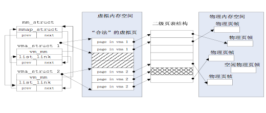

# 实验四：虚拟内存管理

17343025 冯浚轩 软件工程1班

同步到[GitHub](https://github.com/sky-5462/OS_Ucore)

## 实验目的

- 了解虚拟内存的Page Fault异常处理实现
- 了解页替换算法在操作系统中的实现

## 实验要求

- 本次实验是在实验二的基础上，借助于页表机制和实验一中涉及的中断异常处理机制，完成Page Fault异常处理和FIFO页替换算法的实现，结合磁盘提供的缓存空间，从而能够支持虚存管理，提供一个比实际物理内存空间“更大”的虚拟内存空间给系统使用。这个实验与实际操作系统中的实现比较起来要简单，不过需要了解实验一和实验二的具体实现。实际操作系统系统中的虚拟内存管理设计与实现是相当复杂的，涉及到与进程管理系统、文件系统等的交叉访问
- 可以尝试完成扩展练习，实现clock页替换算法（选做）

## 实验方案

在本实验中使用另一个硬盘镜像作为交换分区，在Makefile中要相应做出修改

```makefile
my-qemu: $(UCOREIMG) $(SWAPIMG)
	$(V)$(QEMU) -S -s -nographic -no-reboot $(QEMUOPTS)

my-debug: $(UCOREIMG) $(SWAPIMG)
	$(V)gdb -q -x tools/gdbinit
```

接着填写已有实验，并完成练习

## 实验过程

### 新增数据结构的理解

在前面的实验中我们建立了对物理内存的分页管理，为了支持虚拟内存管理，我们还需要建立描述虚拟内存空间的数据结构，在该系统中使用两个结构体进行管理

```c
struct mm_struct {
    list_entry_t mmap_list;        // linear list link which sorted by start addr of vma
    struct vma_struct *mmap_cache; // current accessed vma, used for speed purpose
    pde_t *pgdir;                  // the PDT of these vma
    int map_count;                 // the count of these vma
    void *sm_priv;                   // the private data for swap manager
};

struct vma_struct {
    struct mm_struct *vm_mm; // the set of vma using the same PDT 
    uintptr_t vm_start;      // start addr of vma      
    uintptr_t vm_end;        // end addr of vma, not include the vm_end itself
    uint32_t vm_flags;       // flags of vma
    list_entry_t list_link;  // linear list link which sorted by start addr of vma
};
```

管理方式类似于空闲页管理，其中一个`mm_struct`结构体对应一个一级页表，在`*pgdir`变量中保存一级页表首地址，可以将该结构体其视为双向链表的占位头节点

而`vma_struct`结构体是双向链表的实际数据节点，每个结构体实例描述了一段连续的虚拟地址，用`vm_start`和`vm_end`表示起始，每个实例内还保存了该段虚拟内存的状态位，在vmm.h文件中有状态位的定义如下，分别指示是否可读，可写和可执行

```c
#define VM_READ                 0x00000001
#define VM_WRITE                0x00000002
#define VM_EXEC                 0x00000004
```

在实验手册中给出了这些内存管理结构的映射关系



---

在实验练习中需要实现FIFO页替换算法，为了将已调入的页组织成队列，扩展物理页描述符`Page`结构体，其中`pra_page_link`用于构造队列链表，`pra_vaddr`表示此物理页对应的虚拟页的地址

```c
struct Page {
    list_entry_t pra_page_link;     // used for pra (page replace algorithm)
    uintptr_t pra_vaddr;            // used for pra (page replace algorithm)
};
```

在swap.h文件中描述了指向硬盘的页表项的定义，指向硬盘时高24位是扇区地址位，低8位是保留位用于实现特定功能

```c
/* *
 * swap_entry_t
 * --------------------------------------------
 * |         offset        |   reserved   | 0 |
 * --------------------------------------------
 *           24 bits            7 bits    1 bit
 * */
```

为了实现页替换算法，在swap.h文件中设计了一个管理器接口，主要由指向实现页替换功能的函数指针组成

```c
struct swap_manager
{
     const char *name;
     /* Global initialization for the swap manager */
     int (*init)            (void);
     /* Initialize the priv data inside mm_struct */
     int (*init_mm)         (struct mm_struct *mm);
     /* Called when tick interrupt occured */
     int (*tick_event)      (struct mm_struct *mm);
     /* Called when map a swappable page into the mm_struct */
     int (*map_swappable)   (struct mm_struct *mm, uintptr_t addr, struct Page *page, int swap_in);
     /* When a page is marked as shared, this routine is called to
      * delete the addr entry from the swap manager */
     int (*set_unswappable) (struct mm_struct *mm, uintptr_t addr);
     /* Try to swap out a page, return then victim */
     int (*swap_out_victim) (struct mm_struct *mm, struct Page **ptr_page, int in_tick);
     /* check the page relpacement algorithm */
     int (*check_swap)(void);
};
```

在练习2中需要实现FIFO页替换算法，其使用到的管理器在swap_fifo.c文件中有定义

```c
struct swap_manager swap_manager_fifo =
{
     .name            = "fifo swap manager",
     .init            = &_fifo_init,
     .init_mm         = &_fifo_init_mm,
     .tick_event      = &_fifo_tick_event,
     .map_swappable   = &_fifo_map_swappable,
     .set_unswappable = &_fifo_set_unswappable,
     .swap_out_victim = &_fifo_swap_out_victim,
     .check_swap      = &_fifo_check_swap,
};
```

### 练习1：给未被映射的地址映射上物理页

当CPU的访存操作无法正常访问到物理内存时就会产生Page Fault异常，经过异常中断后CPU控制权会转移到`do_pgfault(struct mm_struct *mm, uint32_t error_code, uintptr_t addr)`函数进行异常处理，对于传入的参数

- `*mm`为产生异常时使用的一级页表对应的`mm_struct`结构体实例的地址
- `error_code`为异常产生时生成的错误码，错误码包括一下几位
  - 第0位存在位，为0表示对应物理页不存在
  - 第1位读写位，为1表示写异常，写了只读页
  - 第2位权限位，为1表示权限异常，用户态程序访问了内核空间
- `addr`为产生异常时CPU加载到CR2寄存器的线性地址，通过这个地址可以找到对应的页表

函数开始时首先要找到产生异常对应的`vma_struct`结构体实例

```c
struct vma_struct *vma = find_vma(mm, addr);
```

然后再根据`error_code`和`vma`中的状态位进行权限检查，在该处理函数中若权限检查不通过就直接退出，若能通过检查才进行接下来涉及页处理的语句

```c
//If the addr is in the range of a mm's vma?
if (vma == NULL || vma->vm_start > addr) {
    cprintf("not valid addr %x, and  can not find it in vma\n", addr);
    goto failed;
}
//check the error_code
switch (error_code & 3) {
default:
        /* error code flag : default is 3 ( W/R=1, P=1): write, present */
case 2: /* error code flag : (W/R=1, P=0): write, not present */
    if (!(vma->vm_flags & VM_WRITE)) {
        cprintf("do_pgfault failed: error code flag = write AND not present, but the addr's vma cannot write\n");
        goto failed;
    }
    break;
case 1: /* error code flag : (W/R=0, P=1): read, present */
    cprintf("do_pgfault failed: error code flag = read AND present\n");
    goto failed;
case 0: /* error code flag : (W/R=0, P=0): read, not present */
    if (!(vma->vm_flags & (VM_READ | VM_EXEC))) {
        cprintf("do_pgfault failed: error code flag = read AND not present, but the addr's vma cannot read or exec\n");
        goto failed;
    }
}
/* IF (write an existed addr ) OR
    *    (write an non_existed addr && addr is writable) OR
    *    (read  an non_existed addr && addr is readable)
    * THEN
    *    continue process
    */
```

进入页处理流程，首先要设置`perm`变量用于接下来的权限表示，然后再将`addr`线性地址对齐到页大小以便获取二级页表项

```c
uint32_t perm = PTE_U;
if (vma->vm_flags & VM_WRITE) {
    perm |= PTE_W;
}
addr = ROUNDDOWN(addr, PGSIZE);
```

然后调用`get_pte()`函数获取`addr`线性地址对应的二级页表项，若页表项全为0表示该线性地址与物理地址尚未建立映射或者已经撤销，需要调用`pgdir_alloc_page()`函数申请一块物理页并建立其与页表的映射，这两个函数都涉及调用`alloc_pages()`函数申请新页，若当前没有可分配的物理页会触发页换出

```c
ptep = get_pte(mm->pgdir, addr, 1);
if (*ptep == 0) {
    pgdir_alloc_page(mm->pgdir, addr, perm);
}
```

若页表项不全为0表示相应的物理页在硬盘上，首先检查硬盘换页机制是否能工作，若不能工作则处理失败，否则继续处理，调用`swap_in()`函数将硬盘上的物理页调入内存，函数结束后`page`变量获得调入内存页的页描述符地址，再建立该物理页与页表的映射关系，最后设置该页为可交换页，并且要将该页的`pra_vaddr`变量赋值为传入的线性地址`addr`

```c
else {
    if (swap_init_ok) {
        struct Page *page = NULL;
        swap_in(mm, addr, &page);
        page_insert(mm->pgdir, page, addr, perm);
        swap_map_swappable(mm, addr, page, 1);
        page->pra_vaddr = addr;
    }
    else {
        cprintf("no swap_init_ok but ptep is %x, failed\n",*ptep);
        goto failed;
    }
}
```

至此缺页异常的处理例程实现完成，要注意在这里实现的只是一个较为高层次的过程处理，涉及页替换的部分直接调用提供的函数接口，至于页替换算法的实现在下一个练习中实现

---

#### 请描述页目录项（Page Directory Entry）和页表项（Page Table Entry）中组成部分对ucore实现页替换算法的潜在用处

页表项的低8位保存了页的状态信息，其中最低位的存在位决定页表项指向的是物理内存还是硬盘，是必须的，而其它几位可以用来实现页替换算法，例如实现近似LRU算法需要的引用位和实现已修改再换出的脏位都可以用这些保留位来帮助实现

#### 如果ucore的缺页服务例程在执行过程中访问内存，出现了页访问异常，请问硬件要做哪些事情？

硬件会产生异常，将控制权转移到另一个相应的缺页服务例程进行处理，处理完毕后再返回当前的缺页服务例程继续处理，不过这样的调用可能会无限进行下去造成系统崩溃

### 练习2：补充完成基于FIFO的页面替换算法

由swap_fifo.c文件中的注释可知需要补充完整`_fifo_map_swappable()`函数和`_fifo_swap_out_victim()`函数

首先是`_fifo_map_swappable(struct mm_struct *mm, uintptr_t addr, struct Page *page, int swap_in)`函数，用于将新申请页或调入页添加到FIFO页替换算法的队尾，使用传入的`*mm`参数得到替换队列的占位头节点，再使用传入的`*page`参数得到要加入队尾的节点，将其插入到双向链表中头节点之前，也就是插入到了队尾

```c
list_entry_t *head=(list_entry_t*) mm->sm_priv;
list_entry_t *entry=&(page->pra_page_link);
assert(entry != NULL && head != NULL);
list_add_before(head, entry); // added
return 0;
```

然后是`_fifo_swap_out_victim(struct mm_struct *mm, struct Page ** ptr_page, int in_tick)`函数，用于确定换出的页，使用传入的`*mm`参数得到替换队列的占位头节点，其后一个节点代表要被换出的页，将其从链表中删去，并找到对应的页描述符`Page`结构体的地址返回到`**ptr_page`指向的内存

```c
list_entry_t *head=(list_entry_t*) mm->sm_priv;
    assert(head != NULL);
assert(in_tick==0);
// added below
list_entry_t *del = head->next;
list_del(del);
struct Page *page = le2page(del, pra_page_link);
*ptr_page = page;
return 0;
```

编译运行，可以得到以下结果

```text
check_vma_struct() succeeded!
page fault at 0x00000100: K/W [no page found].
check_pgfault() succeeded!
check_vmm() succeeded.
ide 0:      10000(sectors), 'QEMU HARDDISK'.
ide 1:     262144(sectors), 'QEMU HARDDISK'.
SWAP: manager = fifo swap manager
BEGIN check_swap: count 1, total 31964
setup Page Table for vaddr 0X1000, so alloc a page
setup Page Table vaddr 0~4MB OVER!
set up init env for check_swap begin!
page fault at 0x00001000: K/W [no page found].
page fault at 0x00002000: K/W [no page found].
page fault at 0x00003000: K/W [no page found].
page fault at 0x00004000: K/W [no page found].
set up init env for check_swap over!
write Virt Page c in fifo_check_swap
write Virt Page a in fifo_check_swap
write Virt Page d in fifo_check_swap
write Virt Page b in fifo_check_swap
write Virt Page e in fifo_check_swap

// ...

page fault at 0x00001000: K/R [no page found].
swap_out: i 0, store page in vaddr 0x2000 to disk swap entry 3
swap_in: load disk swap entry 2 with swap_page in vadr 0x1000
count is 0, total is 7
check_swap() succeeded!
++ setup timer interrupts
serial [013]
100 ticks
100 ticks
100 ticks
```

首先系统检查虚拟内存管理的数据结构是否正常，检查通过后再检查缺页异常的处理是否正常，练习1正确完成后该部分能通过检查，这一步后虚拟内存管理能通过检查，之后再检查页替换算法是否正常，中间输出了检查过程中的换入换出等信息，练习2正确完成后该部分能通过检查，表示该实验正确完成

---

#### 如果要在ucore上实现"extended clock页替换算法"，现有的swap_manager框架是否足以支持在ucore中实现此算法？

现有的框架足以支持实现"extended clock页替换算法"，不同的算法差异只体现在需要换出页面时决定换出哪一页，i386架构在页表项的保留位中设计了访问位和修改位，在硬件上提供访存时对访问位的置位，在页交换管理器的`swap_out_victim()`函数内使用这些位设计算法即可实现需求

#### 需要被换出的页的特征是什么？

对于Enhanced Clock算法，调入内存的页根据访问位和修改位分为4个优先级，对（访问位，修改位）的有序数对有

1. (0,0)表示既不近期被访问也没有被修改，优先替换
2. (0,1)表示近期不被访问但被修改了，由于需要换出不如上一级好
3. (1,0)表示最近被访问但没有被修改，可能在近期再被访问，优先级更低
4. (1,1)表示既被近期访问又被修改，可能造成最大的开销，优先级最低

#### 在ucore中如何判断具有这样特征的页？

在涉及页替换的操作中，遍历已调入页的链表，按照以上优先级得到最终决定的调出页

#### 何时进行换入和换出操作？

通过页表项查找到引发缺页异常的页在硬盘交换区时就需要进行换入操作，若换入时没有空闲页了再根据上述优先级决定替换页，对修改位被置位的页需要进行换出操作保存到硬盘交换区，然后再把需要换入的页调入内存

## 实验总结和对比

### 对比答案说明差异

在缺页异常处理例程部分，我的实现少了一些错误处理，下面是答案的实现

```c
if ((ptep = get_pte(mm->pgdir, addr, 1)) == NULL) {
    cprintf("get_pte in do_pgfault failed\n");
    goto failed;
}

if (*ptep == 0) { // if the phy addr isn't exist, then alloc a page & map the phy addr with logical addr
    if (pgdir_alloc_page(mm->pgdir, addr, perm) == NULL) {
        cprintf("pgdir_alloc_page in do_pgfault failed\n");
        goto failed;
    }
}
```

下面是我的实现

```c
ptep = get_pte(mm->pgdir, addr, 1);
if (*ptep == 0) {
    pgdir_alloc_page(mm->pgdir, addr, perm);
}
```

缺页异常处理例程在正常执行完操作后会返回0，而发生错误时会返回其它值，我的实现虽然能通过检测，但可能在以后的实验中带来异常，因此按照答案的方式进行修改

---

在FIFO换页算法部分也是缺少一些异常判断，加上即可，我的实现中链表头的后继是队头，而答案中链表头的先导才是队头，两种只要中间过程一致就没有问题

### 本实验中重要的知识点

- 按需分配页
- 页替换算法

这两点也是在OS原理中虚拟内存部分的重点

### OS原理中很重要但实验中没有对应的知识点

我觉得没有，都有涉及了

### 总结

这次实验涉及到虚拟内存管理的相关内容，让我在具体实现的层面上对虚拟内存、缺页异常和页替换处理上有了更加深入的了解。这两个内存管理的实验解答了我的一些疑惑，比如说我先前以为页表项的状态位是要在地址位之外扩展的，这样页表项就不能字节对齐了，感觉不自然，而在这两个实验中我发现可以把状态位放入地址位的低位，这样能充分利用页表项的空间

当然了这里面也还包括对新增数据结构的理解和对实现原理的理解，几个实验下来我对这个系统的结构也比较了解了，做起来也比较快了，这样的一个实验让我对操作系统的深入理解有很大的帮助

## 参考文献

- [实验指导手册](https://github.com/chyyuu/ucore_os_docs/blob/master/SUMMARY.md)
- [i386的页表项说明](https://www.jianshu.com/p/3b15987b42d2)
- [扩展时钟算法](https://blog.csdn.net/weixin_42061048/article/details/80226850)